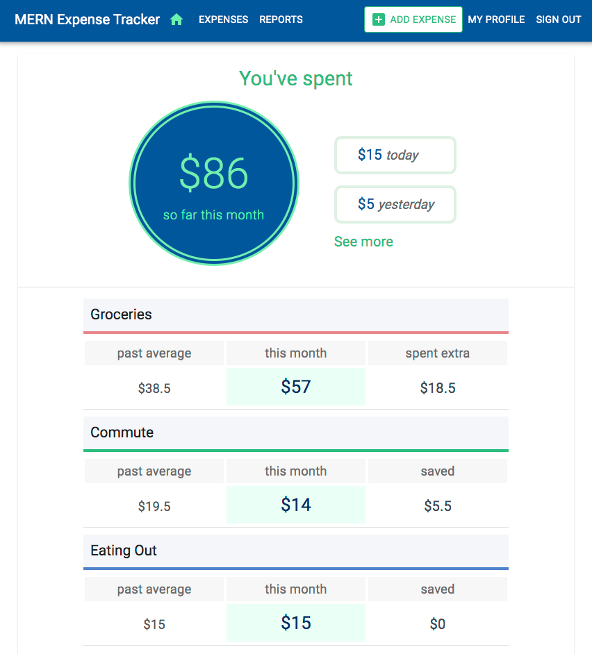
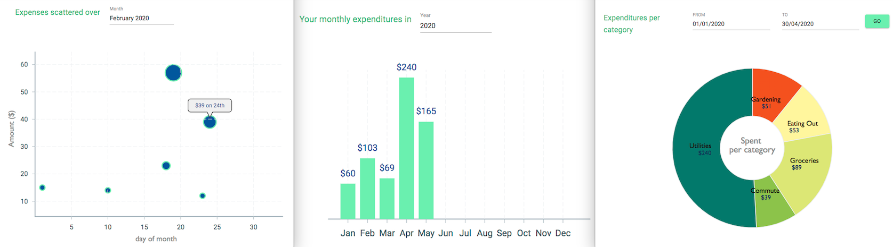

# 💰 FinTrack - MERN Expense Tracker

A responsive and user-friendly expense tracking web app developed using the **MERN stack** (MongoDB, Express.js, React.js, Node.js). FinTrack helps users manage their finances by tracking daily expenses and visualizing spending trends through interactive charts.

---

## 📸 Screenshots

### Dashboard Overview


### Add New Expense


---

## 🚀 Features

- 📊 Interactive data visualization with Victory.js
- ✅ Add, edit, and delete expenses
- 🔐 JWT-based user authentication
- 🌐 RESTful APIs using Express.js
- 📁 Persistent data with MongoDB
- ⚡ Responsive UI built in React
- 💬 Real-time feedback & validation

---

## 🛠 Tech Stack

| Technology   | Purpose                       |
|--------------|-------------------------------|
| React        | Frontend UI                   |
| Node.js      | Backend runtime               |
| Express.js   | Server and API routing        |
| MongoDB      | Database                      |
| Mongoose     | MongoDB ODM                   |
| Victory.js   | Data visualization            |
| JWT + Bcrypt | Auth & password encryption    |

---

## 📦 Installation & Setup

1. **Clone the repository**
```bash
git clone https://github.com/Yogesh297/fintrack.git
cd fintrack
